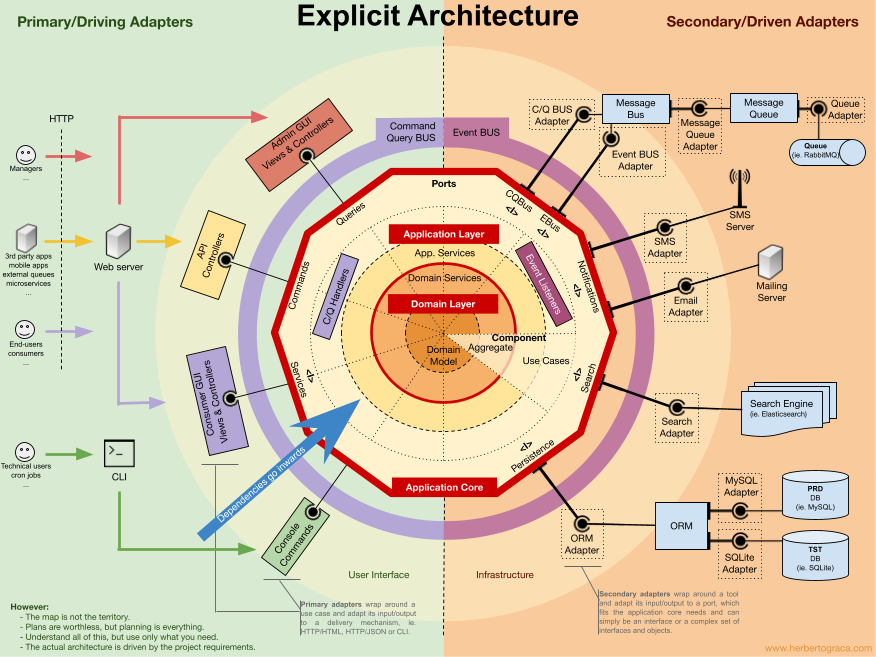

# Achitecture

Robert Martin in **Clean Architecture** once said:

## Architecture is for a flexibility in our application

I always cringe on startups that create MVP and then use it as a base for next iterations.
Usually their code is duct taped to everything inside.
There is no structure, no thought, just a forgotten need to validate the idea.

Good Architecture is an ability to quickly change our code to the requirements.
All those interfaces, small classes and dependency inversion is there 
for easier experimantation, testability and easier replacement.

(However don't overdo it fot the sake of simplicity aka less mental load.
Small refactors during works is nothing bad.)

What should you say to your manager?
Good Architecture decreases cost of a change.

But what to say to programmers? Say That:

## Good structure = less mental load

Have you seen that lifeless programmers going through the kitchen.
Or those being always nervous or just silently furious underneath?

Welcome to the hell of the bad architecture.
Here when you go to wash your hand, you have to think also about:
- water supply
- sewage systems
- water level in the ocean
- and so on

Because everything is so tightly connected and every change brings horrible risks.
Stress is overwhelming and any change brings another jug to the big ball of mud.

It is not a development anymore, it is human sewage system.
Be happy, be **a whole as a human being**, treat your architecture.

What should you say to your manager?
Better architecture suppresses burnout.

But what is most important for me is:

## Self-Similar Design
One of my favorite blog post is one mentioning [explicit architecture](https://herbertograca.com/2017/11/16/explicit-architecture-01-ddd-hexagonal-onion-clean-cqrs-how-i-put-it-all-together/), 
ending with this image:

It has a place for everything.
You don't need to think where should I put this.
Or where should I find that.

In good architecture everything has its place.

There are places/layers for caching the data that do not collide with business logic.
Flexible ways of communicating between the components.
Ability to plug new stuff, discarding the old.

Everytime you find yourself in a new place, you feel familiar.

Because of good architecture a manager can notice:
A happy team with a steady pace.

### Buckle up!

If you want to read more then take on those books:
1. [[Clean Architecture]]
2. [[Patterns of enterprise application architecture]]
3. [[Domain Driven Design]]
4. [[Implementing DDD]]