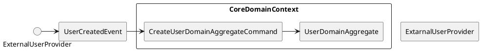

# Domain Driven Design - Kickstarter

### Why am I doing this presentation
- Make people want to do DDD
- Outline advanced concepts from DDD
- Give them tools and further steps to implement DDD

### Abstrakt

Coraz więcej projektów to słabej jakości bomba, które tykamy jedynie za fakt dostawania przysłowiowych 15k na rękę.
Nie ważne czy dołączasz do nowego projektu prowadzonych przez "doświadczonych programistów", czy do wielkiego molocha legacy.
Zazwyczaj spotkasz się z setkami serwisów, które w kuriozalny sposób łączą się ze sobą, by na samym końcu cudem dać użytkownikowi tę kluczową wartość biznesową.
Czy w programowaniu obiektowym nie zapomnieliśmy, że mieliśmy modelować właśnie zasady biznesowe, a nie code debt?

Na tej prezentacji lekko wprowadzę was w świat DDD i przedstawię to, co mnie zafascynowało w tym podejściu:
- Jak zobrazować sobie cały system razem z ludźmi z biznesu — czyli czym jest "Event Storming"
- Jak wrócić do modelowania obiektowego zachowania domeny — czyli o "root aggregates" i "design patterns" słów kilka
- Jak dzielić naszą domenę i walczyć ze złożonością — czyli "bounded contexts" i event "driven architecture".

Jako materiał wspierający:
- DDD w Kotlinie? -Ugryź to ze Springiem i Hibernate
- Co dalej? - CQRS i Event Sourcing

Co wyniesiesz z tej prezentacji?:
- Inspiracje i dalsze kroki co do dalszej nauki DDD
- Wstępną wiedzę, która pozwoli Ci wstępnie zaimplementować DDD w Kotlinie
- Wiedzę na temat potrzebnych technologii, by implementować DDD w innych językach

Do Zobaczenia.

### Conspect

1. Introduction
	1. Do you remember when animal.say() did woof or meow?
		1. It was called object modelling
	2. Why now everywhere are services storing records not object?
	3. DDD is a journey back to the OOP from the Structural programming we do
2. Why should you use DDD IMO
	1. For Programmer: DDD is mapping of concept we have in our head into code
	2. For Business: Is putting domain in the first place so it is readable
	3. For Architect: Allows u to separate things that are important from those less
3. Problem statement: We are modelling domain registrar
	1. Use Cases:
		1. As a User, I want to register domain
		2. As a User, I want to transfer domain to other user
		3. As a Registrar, I want for user to pay for domain
4. Introduction to Event Storming 

