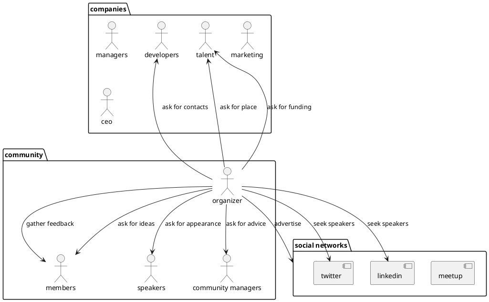

 # Entities and Value Objects

## Meetup Event

- Timespace
	- Date
	- Time
	- Place
		- Map
		- Instructions
- Introduction (What/Why/How)
- Agenda
- Further Opportunities
	- Opportunities for collaboration
		- Whom to write to
		- Who we need
	- Opportunity for the next event

# Possible interactions between meetup actors

