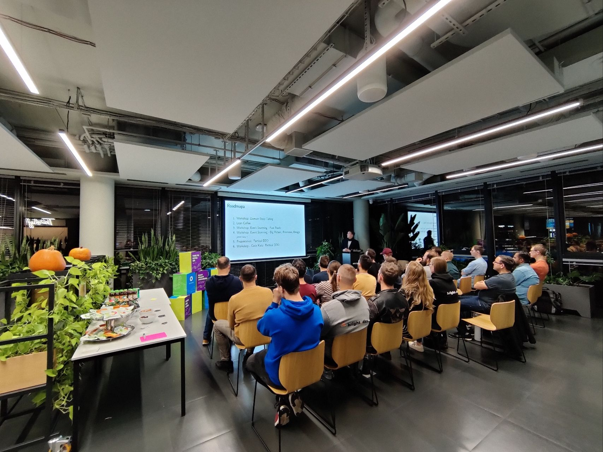
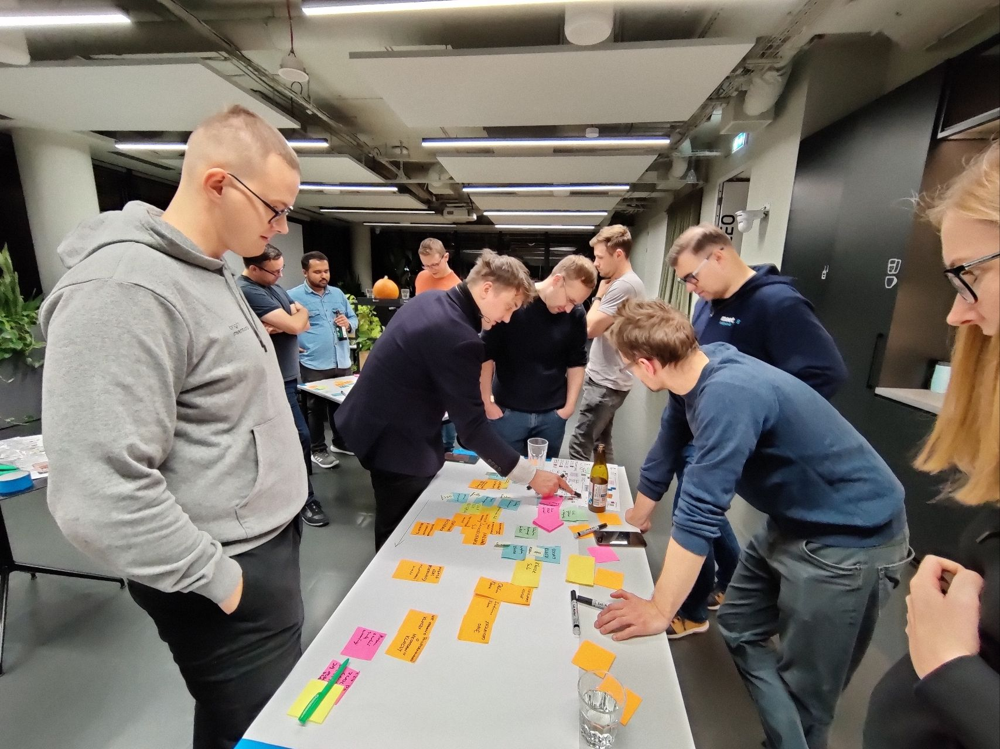
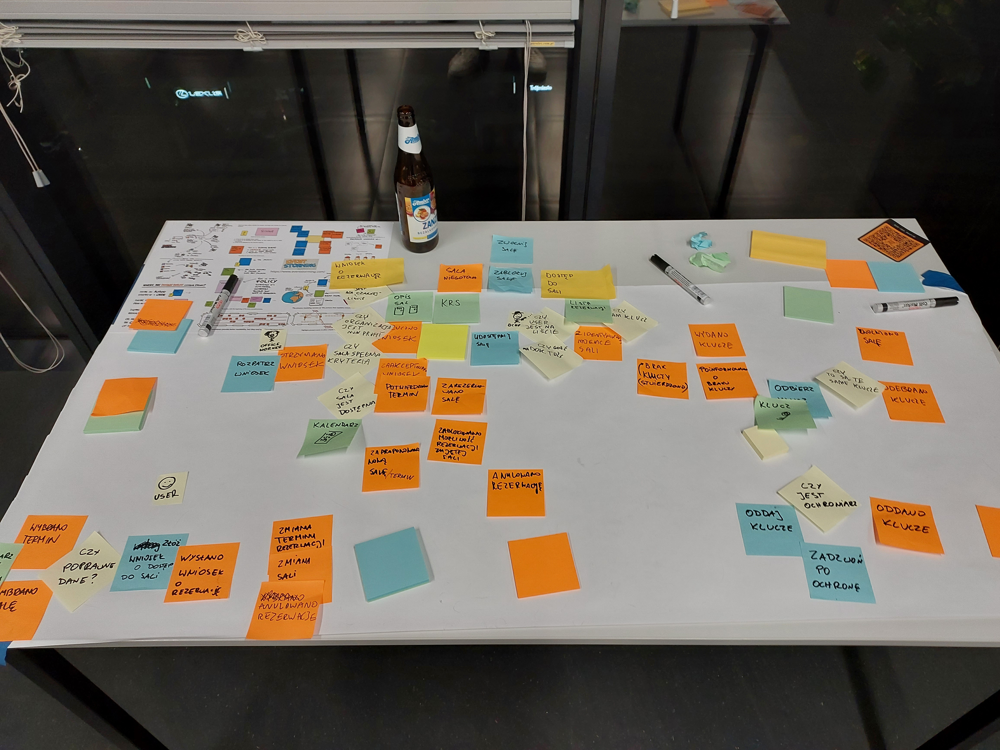
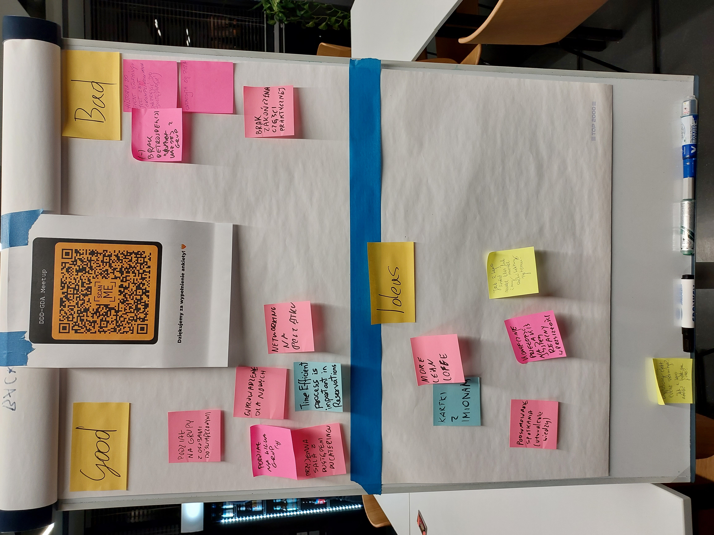
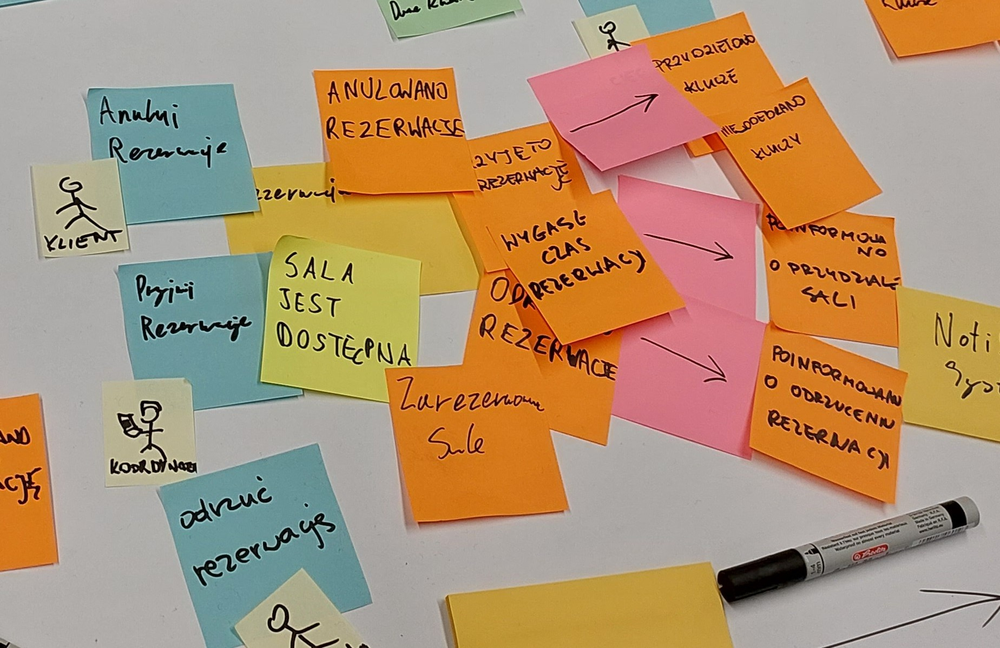

### Links
- [introductionary presentation](https://gitlab.com/oneacik/lifecycle/-/blob/master/prezentacje%20i%20warsztaty/presentation/DDD-GDA-10-2022-event-storming/template.pdf)
- [Miro Template for Event Storming](https://miro.com/app/board/o9J_kt3rZb4=/)
- [ES CheetSheet](./EventStorming.png)
- [meetup event](https://www.meetup.com/pl-PL/ddd-gda/events/288475031/)
- [Survey](WORKSHOP.ods)

### Retro
- Good
	- Podział na grupy po doświadczeniu
	- Wprowadzenie dla nowych
	- Networking na początku
	- Przyjemna sala z dostępem do cateringu
- Bad
	- Brak zakończenia części praktycznej
	- **Brak retrospekcji każdej z grup**
	- Skończyła się pizza
	- Historia do event stormingu jest zbyt skomplikowana
- Ideas
	- Więcej lean coffee
	- **Kartki z imionami**
	- **Podsumowanie spotkania**
	- **Koniecznie opierać się na realnych systemach**

### Photos

### Survey Conclusions
- Half of the people want a group, but they are not conclusive on form (Slack/Fb/Discord)
- There are only few people who want to help in organising a meetup
- Most of the people are Developers. Couple are Team Leaders, Architects. Sometimes they may happen a PM.

### Leader Notes

Historia facylitacji systemu rezerwacji:
- Do skończenia w 30 minut
- Doskonały do przećwiczenia różnych nowych mechanik Event Stormingu
- Wstępna historyjka dostępna na końcu ostatniego meetupu

Uber:
- Nie udało się skończyć wszystkiego w 1h
- Ciekawy przypadek na naukę ekstrakcji domeny

> Można wybrać swoją własną domenę w grupie

Facylitacja:
3x{
20 minut - event storming (Big Picture/Processy/Konteksty i Agregaty)
10 minut - krążenie po innych stanowiskach (2 osoby muszą zostać)
}

Rezultat:
Design Level - Do agregatów, nie dalej?
z podziałem na swimlanesy wobec aktorów.

W porównaniu do warsztatu z Mariuszem Gilem:
Nowe kartki: Actor, View, Aggregate, Policy(?).

Wydrukowałem ściągi, gdzie jest pokazana ścieżka prosto do design lvl - warto się z nimi zapoznać przed ES.

Rozdział na grupy:
1. Kto prowadził ES i chce facylitować
1. Kto był na ES
1. Kto nie był na ES nigdy

Na końcu retrospektywa:
- pytania (zrobimy z nich expert interview)
- co dobre, a co do poprawienia (to było eksperymentalne)

Stare notki:
Na kolejnym spotkaniu
Powiedzieć, że będzie retro i pytania
Ręce do góry i kto potrafi wytłumaczyć poziom kodu ten idzie jako facylitator event stormingu
3 x sesja (30 minut es + 15 minut refleksji) podczas tego zapisywać pytania
w czasie refleksji pół grupy idzie w prawo i rozmawia o tym co wyszło, potem druga połowa idzie w lewo
pytania zostaną użyte pod kolejne warsztaty, czy expert interview

