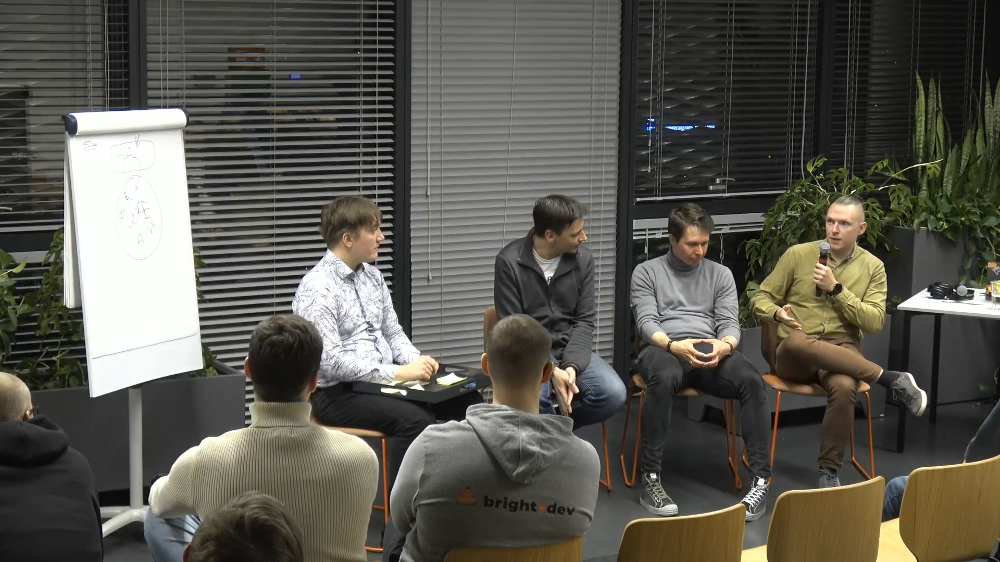
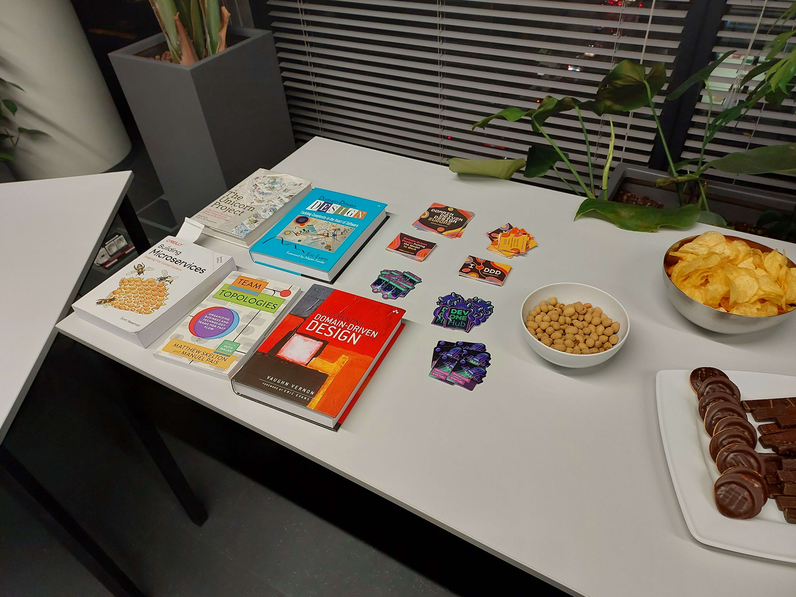
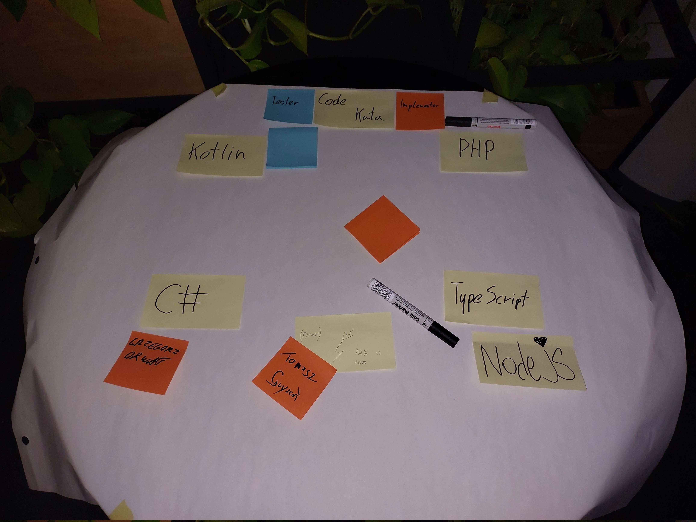

# Tactical DDD: Building Blocks

### Materials

- [Introductionary Presentation](https://gitlab.com/oneacik/lifecycle/-/blob/master/prezentacje%20i%20warsztaty/presentation/DDD-GDA-11-2022-ddd-building-blocks/template.pdf)
- [Presentation](https://docs.google.com/presentation/d/1aCNpLNSvyNVlh_4sRBV97GPUiwGHan0XebB6MOAiAJU/edit#slide=id.p)
- [CQRS repository](https://github.com/Efpkaf/DDD-basic-components)
- [Meetup Event](https://www.meetup.com/pl-PL/ddd-gda/events/289396427/)
- [[DDD-GDA-LEADERSHIP 23-11-2022|Leadership]]

### Photos

### Personal Notes

- I always forget to take photos of people on meetups or ask others to take them
- If I want to get more people for an initiative I need to sell it to them and I need to ask in person
