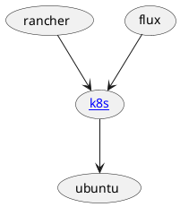

## Information can be visualized like

### Tree




### Table

### Graph

```plantuml

(Uncertainty) -u-> (Planning)
(Uncertainty) -u-> (Project Work)
(Uncertainty) -d-> (Delivery)
(Uncertainty) -d-> (Measurement)
```

it can be also represented as graph table

| X            | Uncertainty | Planning | Project Work | Delivery | Measurement |
| -            | -           | -        | -            | -        | -           |
| Uncertainty  | .           | X        | X            | X        | X           |
| Planning     | X           | .        |              |          |             |
| Projcet Work | X           |          | .            |          |             |
| Delivery     | X           |          |              | .        |             |
| Measurement  | X           |          |              |          | .           |

