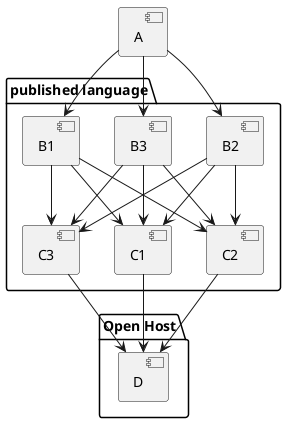

## 2022-09-29 C4

[[C4]]

C4 trzymać w:

| Nazwa      | Miejsce                    |
|------------|----------------------------|
| System     | Na głównym README projektu |
| Container  | Deployment Charts          |
| Componenet | Spring Configuration       |
| Code       | Wyjebać                    |

Enterprise Architect
Wtyczka do Plantuml

## 2022-09-29 Krystalizowanie Kontekstów - Sobótka

Syjamska Modularyzacja
Splątanie w Arhitekturze

Zawsze się sptytaj, po chuj ten model?

Fajna prezentacja z randomowymi obrazkami

Published Language kładzie componenty na równi
component <--> component2

Jak nie ma ownera danej rzeczy, to zachodzi dryf architektoniczny

Building Better Software Using Archetype

Cynefin

Struktura Rzeczowników?

Process Manager vs Saga

- Enterprise Patterns & MDA

[[Event Storming]] = Zbieranie informacji -potem-> analiza -i-> Achitektura

chunk up/chunk down

"Książe - Macchiaveli"

Product vs Capability

## 2022-09-29 Łukasz Cośtam - O Architekturze

4 Key Metrics -> "Accelerate"

"Fundamentals of Software Atchitecture" - Łukasz
slides.com
"Building Evolutionary Architectures"

[ ] Wygeneruj C4 ze spingowej Configuration

Architecture Drivers

Conway's Law <-> Team Topologies?

tools:
1. Tourne po zespołach i zbieranie informacji - mapping używając parafrazy C4
1. Service Blueprint
1. Event Driven Communication

Czy jest PMBOK dla architektury?

**Buduj Gildie wiedzy!!!**

ADR = Architecture Design Record
"Software Architecture Metrics"

**Fitness Function Testing Pyramid**
Conway -> dotyczy firmy, a nie zespołów programistycznych
