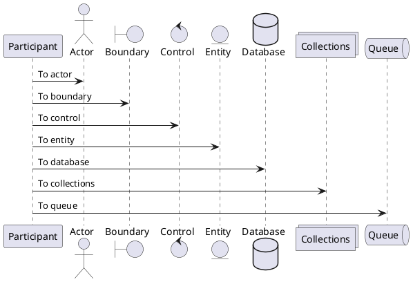
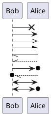
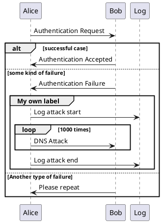

# Plantuml

## Sequence

### Actors


### Arrows


### Cases



## Examples

### Example of Sequence Diagram

```
@startuml

participant "Swift Web Viewer" as viewer
participant "SSO Frontend" as SSOF
participant "SSO Backend" as SSOB
participant "Old Auth" as auth
participant iCloud as iC
participant "Cockroach DB" as db
participant "Identity Provider" as IP
participant "Event Queue" as que

viewer -> viewer : wants to authenticate with Goodnotes Cloud
viewer -> SSOF : opens authentication page

SSOF -> IP   : user picks identity provider
IP   -> IP   : authenticates
IP   -> SSOF : JWT token is returned
SSOF -> SSOB : sends token
SSOB -> db   : fetches user

alt user doesn't exist
    db -> SSOB : user doesn't exist
    SSOB -> db : creates user
end

db -> SSOB : returns user
SSOB -> SSOF : sends Goodnotes Cloud token
SSOF -> viewer : redirects

@enduml
```
