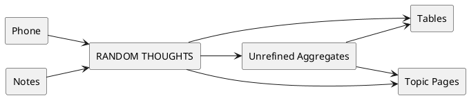

# Meta Garden

## Process

## Garden Consists of
- **Large Tables** - Containing all possible information on given entity, usually containing all informations from different contexts 
- **Tables** - The big aggregators of information which for example point to all books usually in some context
- **Unrefined Aggregates** - Random information put into given category
	- **Random Thoughts** - Random information not yet put into given category
- **Topic Pages** - Pages on given topic in given context, usually having a link from the table

## Glossary
- Context - treat it as a little bounded context. For example list of all companies for one meetup is in different context than for other meetup and should have different fields from the large table
