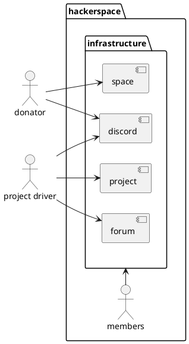
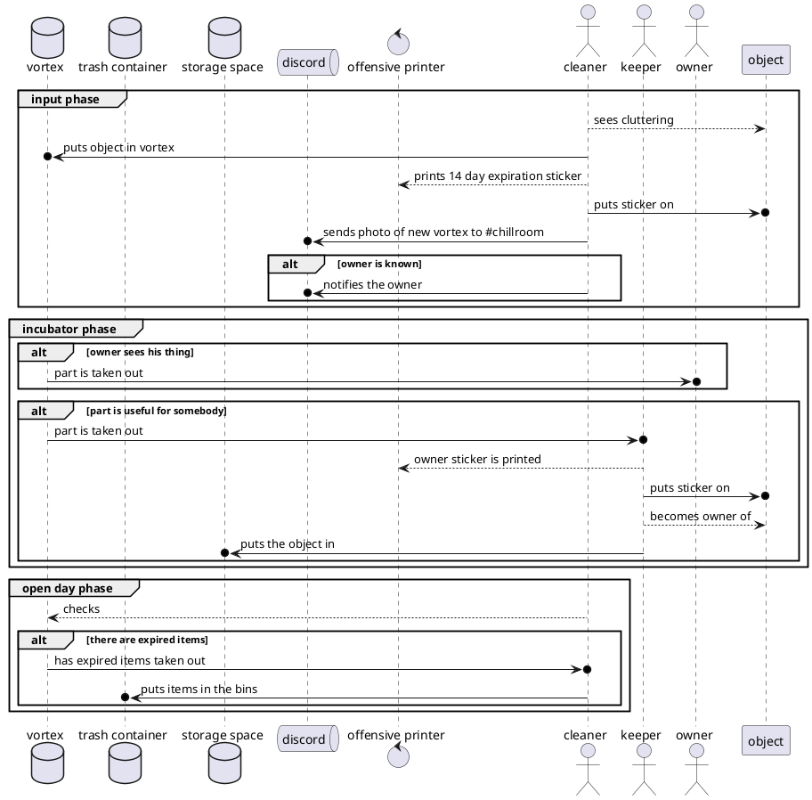

# Hackerspace

```plantuml
@startuml

left to right direction

actor donator
actor "project driver" as pd


package hackerspace {
	package infrastructure {
		component space
		component forum
		component discord
		component project
	}
	actor members
}


donator --> space
donator --> discord

pd --> forum
pd --> discord
pd --> project

members -> infrastructure

@enduml
```

## Vortex Process

```plantuml
@startuml

database vortex
database "trash container" as bins

database "storage space"


queue discord

control "offensive printer" as zebra

actor cleaner
actor keeper
actor owner

participant object

group input phase
	cleaner --> object  : sees cluttering
	cleaner ->o vortex  : puts object in vortex
	cleaner --> zebra   : prints 14 day expiration sticker
	cleaner ->o object  : puts sticker on
	cleaner ->o discord : sends photo of new vortex to #chillroom

	alt owner is known
		cleaner ->o discord : notifies the owner
	end
end

group incubator phase
	alt owner sees his thing
		vortex ->o owner          : part is taken out
	end

	alt part is useful for somebody
		vortex ->o keeper          : part is taken out
		keeper --> zebra           : owner sticker is printed
		keeper ->o object          : puts sticker on
		keeper --> object          : becomes owner of
		keeper ->o "storage space" : puts the object in
	end
end

group open day phase
	cleaner --> vortex     : checks
	alt there are expired items
		vortex  ->o cleaner : has expired items taken out
		cleaner ->o bins    : puts items in the bins
	end
end

@enduml

```

