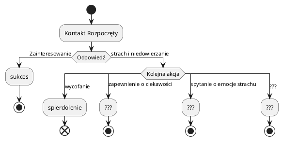

# Algorytm Poznawczy :3

## Dziewojki

```plantuml
@startuml

start

:Kontakt Rozpoczęty;
if (Odpowiedź) then (Zainteresowanie)
	:sukces;
	stop
else (strach i niedowierzanie)
	switch(Kolejna akcja) 
	case (wycofanie)
		:spierdolenie;
		end
	case (zapewnienie o ciekawości)
		:???;
		stop
	case (spytanie o emocje strachu)
		:???;
		stop
	case (???)
		:???;
		stop
	endswitch
endif


@enduml
```

